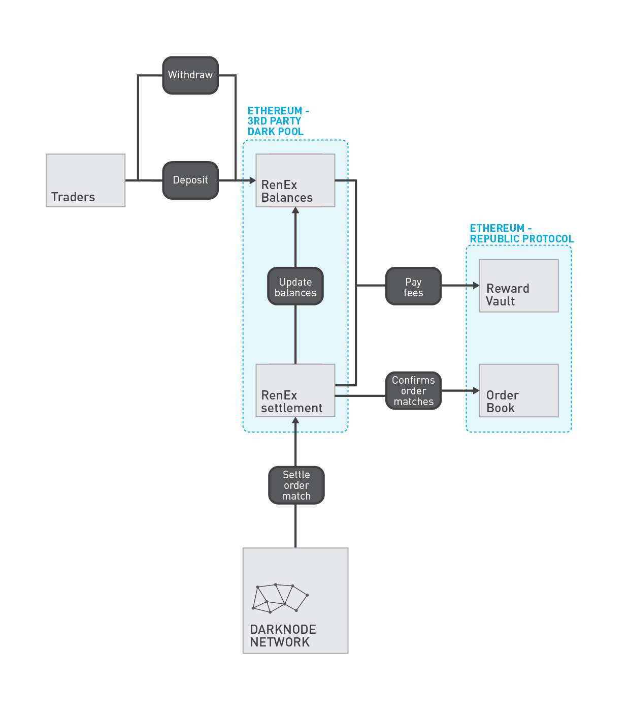
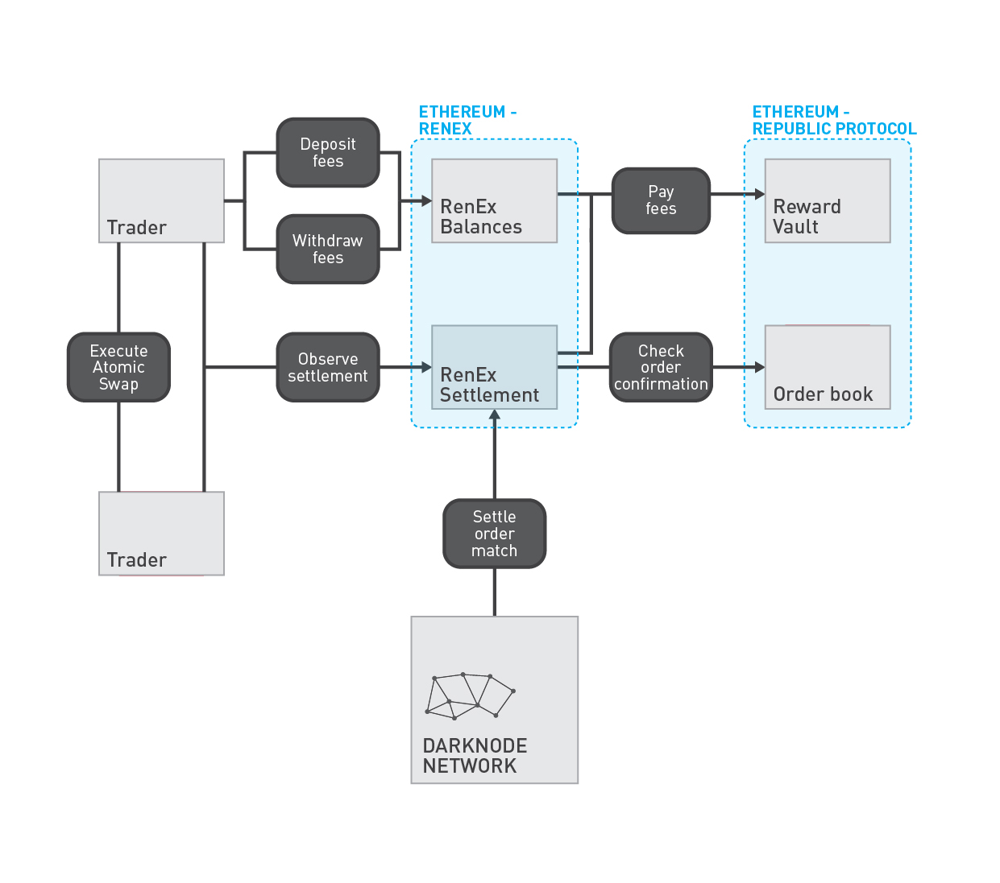

# Settlement

RenEx supports two Settlement Layers that are compatible with the Republic Protocol Settlement ABI: one for exchanging ETH and ERC20s, and another for exchanging ETH and BTC. The two Settlement Layers are not compatible with each other.

## ETH and ERC20s

Settlement Identifier: `1`

Settlement for ETH and ERC20s is immediate and non-interactive. As part of the standard process for Republic Protocol Settlement Layers; Darknodes call `submitOrder` for two matching orders and then call `settle` using the IDs of those two matching orders. The Settlement contract will:

1. verify that the orders are confirmed matches in the Republic Protocol Orderbook,
2. verify that the orders are matching,
3. and execute the settlement at the midpoint price and the maximum volume.

Before opening an order, RenEx uses a combination of KYC/AML and zero-knowledge proofs to ensure that the traders have a sufficiently funded [balance](./01-balances.md) to settle the order. Fees in this Settlement Layer are deducted from the received amount, and so are accounted for as part of this check.

### Paying Fees

The fee paid by each trader is 0.2% of the volume used during settlement. The fee is deducted from the amount received by the trader. Of this 0.2% fee:

- 40% is paid to the Darknode that calls `submitOrder` for the buy order,
- 40% is paid to the Darknode that calls `submitOrder` for the sell order, and
- 20% is paid to RenEx — to be used for the Liquidity Incentive Program.

### Example

- Let's say that Alice wants to buy REN, in exchange for ETH, at a price of 1ETH for 1REN, and Alice is willing to buy up to 10REN.
- Let's also say that Bob wants to sell REN, in exchange for ETH, at a price of 1ETH for 3REN, and Bob is willing to sell up to 4REN.
- Both Alice and Bob open their orders using a Settlement Identifier of `1`.
- Using the Secure Order Matcher, the Darknodes find that these two orders match.
- Darknodes call `submitOrder` for both orders, and then call `settle`.
- The call to `settle` immediately executes the settlement between Alice and Bob. The price point is 2REN for 1ETH (the midpoint between the two orders). Alice receives 3.992REN in exchange for 2ETH, and Bob receives 1.996ETH in exchange for 4REN (the maximum volumes after accounting for the fees). The [balances](./01-balances.md) of Alice and Bob are updated to reflect the settlement, and the difference between the paid amount and the received amount (0.00RREN and 0.004ETH) is used to pay the fee.

## ETH and BTC

Settlement Identifier: `2`

Before opening an order, RenEx uses a combination of KYC/AML and zero-knowledge proofs to ensure that the traders have a sufficiently funded [balance](./01-balances.md): 0.6% of their order, in ETH. See "Paying Fees" for more information.

### Paying Fees

The fee paid by each trader is 0.2% of the volume used during settlement. The fee is not deducted from the amount received by the trader, the trader pays the fee in addition to the trade. Of this 0.2% fee:

- 40% is paid to the Darknode that calls `submitOrder` for the buy order,
- 40% is paid to the Darknode that calls `submitOrder` for the sell order, and
- 20% is paid to RenEx — to be used for the Liquidity Incentive Program.

The nature of an [atomic swap](./03-atomic-swapping.md) is highly interactive. Therefore, it is possible that a malicious trader might abort the atomic swap. This leaves the honest trader having paid a fee of 0.2% for a trade that never happened. To protect honest traders from this behaviour, traders must have *at least* 0.6% of their order (in ETH) in their [balance](./01-balances.md):

- 0.2% is used to pay fees,
- 0.2% is taken from a malicious trader that has aborted the swap, and is used to repay the opposing trader, and
- 0.2% is taken from a malicious trader that has aborted the swap as a further punishment.

### Example

- Let's say that Alice wants to buy BTC, in exchange for ETH, at a price of 10ETH for 1BTC, and Alice is willing to buy up to 10BTC.
- Let's also say that Bob wants to sell BTC, in exchange for ETH, at a price of 10ETH for 3BTC, and Bob is willing to sell up to 4BTC.
- Both Alice and Bob open their orders using a Settlement Identifier of `2`.
- Using the Secure Order Matcher, the Darknodes find that these two orders match.
- Darknodes call `submitOrder` for both orders, and then call `settle`.
- The call to `settle` immediately pays fees from the [balances](./01-balances.md) of Alice and Bob, however settlement is deferred to an [atomic swap](./03-atomic-swapping.md). The [balances](./01-balances.md) of Alice and Bob are used to pay the 0.04ETH fee. The price point of the atomic swap is set to 2BTC for 10ETH (the midpoint between the two orders). Alice will receive 4BTC in exchange for 20ETH, and Bob receives 20ETH in exchange for 4BTC. 