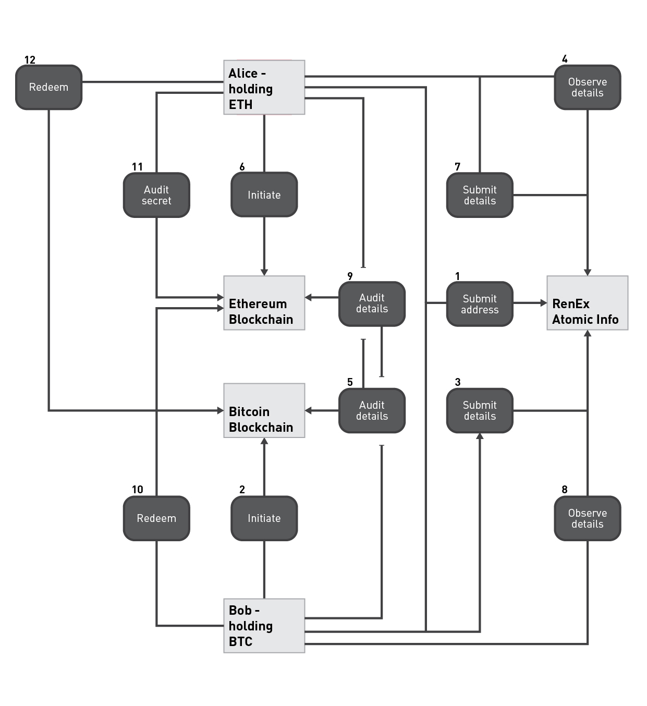

# Atomic Swap

The Atomic Swap is an Ethereum smart contract used to swap tokens cross-chain.

For easier understanding of the concept of atomic swaps, let's look at an example. Assume that Alice has 100 Ether, and she wants to trade it for 10 Bitcoin, and Bob has 10 Bitcoin that he wants to trade for 100 Ether. They decide to do an atomic swap as they do not trust each other to hold their end of the bargain.

At this point in time the match is found, Alice and Bob know each others' order ids.

**(1) Alice & Bob Submit Addresses**
  Alice sends her Bitcoin Address to Bob, and Bob sends his Ethereum address to Alice, by calling the `setOwnerAddress(bytes32 _orderID, bytes _owner)` function on RenExAtomicInfo contract.

**(2) Bob Initiates**
  Bob generates a secret, hashes it and uses the hash to initiate an atomic swap for 10 Bitcoin to Alice's Bitcoin Address on the Bitcoin Blockchain. He does this by creating a Bitcoin script, that can be redeemed by Alice to get the 10 Bitcoins or expires in 48 hours refunding his Bitcoins.

**(3) Bob Submits Swap Details**
  Bob submits the swap information to the RenExAtomicInfo contract by calling `submitDetails(bytes32 _orderID, bytes _swapDetails)`, this swap information contains bitcoin initiate transaction details.

**(4) Alice Observes Swap Details**
  Alice observes Bob's swap details by calling `swapDetails(bytes32 _orderID)` on the RenExAtomicInfo contract.

**(5) Alice Audits**
  Alice audits the swap details she received from the RenExAtomicInfo contract by checking against the Bitcoin blockchain. Alice does this by checking whether the redeemer address is correct, the number of bitcoins is as expected and she has enough time to redeem the atomic swap. 

**(6) Alice Initiates**
  If the audit is successful, Alice initiates an atomic swap on Ethereum for 100 Ether to Bob's Ethereum address with the same hash(this acts as the secret lock) and sets the expiry to be 24 hours. Alice does this by calling `initiate(bytes32 _swapID, address _withdrawTrader, bytes32 _secretLock, uint256 _timelock)` on the RenExAtomicSwapper contract.
  
**(7) Alice Submits Swap Details**
  Alice submits the swap information to the RenExAtomicInfo contract by calling `submitDetails(bytes32 _orderID, bytes _swapDetails)`, this swap information contain the swap id which is a random 32 bytes string generated by Alice and will be used in the future steps.
  
**(8) Bob Observes Swap Details**
  Bob observes Alice's swap details by calling `swapDetails(bytes32 _orderID)` on the RenExAtomicInfo contract.

**(9) Bob Audits Swap Details**
    Bob audits the swap details he received from the RenExAtomicInfo contract by checking against the Ethereum blockchain(by calling `audit(bytes32 _swapID)` on the RenExAtomicSwapper contract). Bob does this by checking whether the redeemer address is correct, the number of ether is as expected and he has enough time to redeem the atomic swap. 

**(10) Bob Redeems**
  If the audit is successful,  Bob redeems the atomic swap on Ethereum by calling `redeem(bytes32 _swapID, bytes32 _secret)` on the RenExAtomicSwapper contract. In the process exposing the secret, he generated during step 2 and get's 100 ether.

**(11) Alice Audits Secret**
  Alice audits the secret on the Ethereum blockchain by calling `auditSecret(bytes32 _swapID)` on the RenExAtomicSwapper contract. 
  
**(12) Alice Redeems**
  Alice redeems the atomic swap on the Bitcoin blockchain, using the secret received from the RenExAtomicSwapper contract and receives 10 bitcoins.

## Alternative Executions
* If Bob does not initiate in step 2, then the atomic swap will not happen.

* If Alice does not initiate in step 6, then Bob will be able to refund his bitcoins after the swap expires(which is 48 hours in this case). 

* If Bob does not redeem in step 8, then Alice and Bob will be able to refund and get their tokens back after they expire(in 24 hours and 48 hours in this case).

As one can see, it is not possible to lose tokens in this process, the worst that could happen is that the swap does not go through, and the trader's tokens get locked up for a while.

## Timeline

**(1) Matched**
The orders of Alice and Bob are matched at this state, and the atomic swap process has not started yet, this is the *Matched* state of the atomic swap. From this point, Alice and Bob have 24 hours to send their information to the other party.

**(2) Information Sent**
The participants receive the information required to initiate an atomic swap, and the atomic swap goes into the *Information Sent* state. The participant sending the higher priority token has 24 hours to initiate the atomic swap on their blockchain.

**(3) Requestor Initiated**
The trader sending the higher priority token is called the requestor, and once the requestor gets all the information he needs, he initiates the atomic swap with an expiry of 48 hours on the requestor's blockchain. The atomic swap is now in the *Requestor Initiated* state.

**(4) Responder Initiated**
The trader sending the lower priority token is called the responder, and once he audits the atomic swap details of the requestor.  He initiates an atomic swap on the responder's blockchain. The atomic swap is now in the *Responder Initiated* state.

**(5) Requestor Redeemed**
The requestor audits the atomic swap initiated by the responder if the audit is successful then he redeems the atomic swap on the responder's blockchain using the secret he generated during the initiation process. The requestor gets the responder's tokens. The atomic swap enters the *Requestor Redeemed* state.

**(6) Responder Redeemed**
The responder audits the secret on the responder's blockchain and redeems the atomic swap on the requestor's blockchain. The responder successfully gets the requestor's tokens. The atomic swap enters the final state *Responder Redeemed* or *Completed*.
